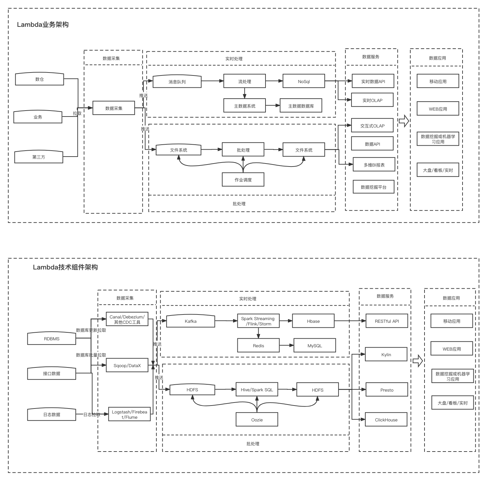

## 题目一: 分析一条 TPCDS SQL (请基于 Spark 3.1.1 版本解答)

SQL从中任意选择一条：
https://github.com/apache/spark/tree/master/sql/core/src/test/resources/tpcds

1. 运行该 SQL ，如 q38 ，并截图该 SQL 的 SQL 执行图
2. 该 SQL 用到了哪些优化规则（ optimizer rules )
3. 请各用不少于 200 字描述其中的两条优化规则

*帮助文档: 如何运行该SQL*

*1. 从 github 下载 TPCDS 数据生成器*

```shell
> git clone https://github.com/maropu/spark-tpcds-datagen.git
> cd spark-tpcds-datagen
```

*2. 下载 Spark3.1.1 到 spark tpcds datagen 目录并解压*

```shell
> wget https://archive.apache.org/dist/spark/spark-3.1.1/spark-3.1.1-bin-hadoop2.7.tgz
> tar -zxvf spark-3.1.1-bin-hadoop2.7.tgz
```

*3. 生成数据*

```shell
> mkdir -p tpcds-data-1g
> export SPARK_HOME=./spark-3.1.1-bin-hadoop2.7
> export SPARK_HOME=/Users/winchester/git/spark-tpcds-datagen/spark-3.1.1-bin-hadoop2.7
> ./bin/dsdgen --output-location tpcds-data-1g
```

本地环境直接运行上面命令时我遇到connection refused的问题。把HADOOP集群启动起来不会有connection refused的问题，但生成数据时会有别的错误。后来把bash_profile里面所有的HADOOP变量都unset了，之前尝试只命令行 unset 1个HADOOP_HOME没解决问题。中间还重新格式化了namenode。

一开始的错误提示和Hadoop没启动本地集群或者下面描述的错误是一样的。启动了本地Hadoop集群就没这个错误，但会有别的错误。推测dsdgen命令读到了我的某些环境变量，尝试去用hadoop集群模式运行导致了别的学员没遇到的错误。还未找到dsdgen命令文件中SPARK_CONF[@]和ARGS[@]对应什么。

参考文章:
https://blog.csdn.net/weixin_45468845/article/details/105750062
https://stackoverflow.com/questions/18322102/hadoop-connection-refused-on-port-9000


*4. 下载三个 test jar 并放到当前目录*

```shell
> wget https://repo1.maven.org/maven2/org/apache/spark/spark-catalyst_2.12/3.1.1/spark-catalyst_2.12-3.1.1-tests.jar
> wget https://repo1.maven.org/maven2/org/apache/spark/spark-core_2.12/3.1.1/spark-core_2.12-3.1.1-tests.jar
> wget https://repo1.maven.org/maven2/org/apache/spark/spark-sql_2.12/3.1.1/spark-sql_2.12-3.1.1-tests.jar
```

*5. 执行 SQL*

```shell
> ./spark-3.1.1-bin-hadoop2.7/bin/spark-submit --class org.apache.spark.sql.execution.benchmark.TPCDSQueryBenchmark --jars spark-core_2.12-3.1.1-tests.jar,spark-catalyst_2.12-3.1.1-tests.jar spark sql_2.12-3.1.1-tests.jar --data-location tpcds-data-1g --query-filter "q73"
```

```shell
nohup ./spark-3.1.1-bin-hadoop2.7/bin/spark-submit \
--conf spark.sql.planChangeLog.level=WARN \
--class org.apache.spark.sql.execution.benchmark.TPCDSQueryBenchmark \
--jars spark-core_2.12-3.1.1-tests.jar,spark-catalyst_2.12-3.1.1-tests.jar \
spark-sql_2.12-3.1.1-tests.jar \
--data-location tpcds-data-1g --query-filter "q73"\
> sql_test_output_n_error.log 2>&1 &
```

```shell
nohup ./spark-3.1.1-bin-hadoop2.7/bin/spark-submit \
-c spark.sql.planChangeLog.level=WARN \
--class org.apache.spark.sql.execution.benchmark.TPCDSQueryBenchmark \
--jars spark-core_2.12-3.1.1-tests.jar,spark-catalyst_2.12-3.1.1-tests.jar \
spark-sql_2.12-3.1.1-tests.jar \
--data-location tpcds-data-1g --query-filter "q73"\
> sql_test_output_n_error.log 2>&1 &
```

q73.sql的语句如下:
```sql
SELECT
  c_last_name,
  c_first_name,
  c_salutation,
  c_preferred_cust_flag,
  ss_ticket_number,
  cnt
FROM
  (SELECT
    ss_ticket_number,
    ss_customer_sk,
    count(*) cnt
  FROM store_sales, date_dim, store, household_demographics
  WHERE store_sales.ss_sold_date_sk = date_dim.d_date_sk
    AND store_sales.ss_store_sk = store.s_store_sk
    AND store_sales.ss_hdemo_sk = household_demographics.hd_demo_sk
    AND date_dim.d_dom BETWEEN 1 AND 2
    AND (household_demographics.hd_buy_potential = '>10000' OR
    household_demographics.hd_buy_potential = 'unknown')
    AND household_demographics.hd_vehicle_count > 0
    AND CASE WHEN household_demographics.hd_vehicle_count > 0
    THEN
      household_demographics.hd_dep_count / household_demographics.hd_vehicle_count
        ELSE NULL END > 1
    AND date_dim.d_year IN (1999, 1999 + 1, 1999 + 2)
    AND store.s_county IN ('Williamson County', 'Franklin Parish', 'Bronx County', 'Orange County')
  GROUP BY ss_ticket_number, ss_customer_sk) dj, customer
WHERE ss_customer_sk = c_customer_sk
  AND cnt BETWEEN 1 AND 5
ORDER BY cnt DESC
```

### 上面通过spark-submit调用q73的SQL的执行图如下:


### 该 SQL 用到的优化规则(optimizer rules)

1. Applying Rule org.apache.spark.sql.catalyst.optimizer.ColumnPruning 列剪枝
2. Applying Rule org.apache.spark.sql.catalyst.optimizer.ReorderJoin Join 顺序优化
3. Applying Rule org.apache.spark.sql.catalyst.optimizer.PushDownPredicates 谓词下推
4. Applying Rule org.apache.spark.sql.catalyst.optimizer.NullPropagation  Null 提取
5. Applying Rule org.apache.spark.sql.catalyst.optimizer.ConstantFolding 常量累加
6. Applying Rule org.apache.spark.sql.catalyst.optimizer.InferFiltersFromConstraints 约束条件提取
7. Applying Rule org.apache.spark.sql.catalyst.optimizer.RewritePredicateSubquery 将特定子查询为此逻辑转换为left-semi/anti join


#### PushDownPredicate 描述

PushDownPredicate规则主要将过滤条件尽可能地下推到离数据源端更近。

如q73 SQL中，原来的语法树是先对 store_sales 和 store 做 join，之后再用 store.s_county IN ('Williamson County', 'Franklin Parish', 'Bronx County', 'Orange County')对 join 的结果进行过滤。

join算子大部分情况需要shuffle，网络走一遍比较耗时，耗时长度和两个 join 表的大小有关。这条规则是为了减少参与 join 的表的数据量，降低 join 算子处理时间。经过这个规则优化后原来 join 的条件 从((ss_store_sk#1161 = s_store_sk#666) AND s_county#689 IN (Williamson County,Franklin Parish,Bronx County,Orange County))变成了 ss_store_sk#1161 = s_store_sk#666 而 store.s_county 的s_county#689 IN (Williamson County,Franklin Parish,Bronx County,Orange County) 条件下推到 join之前，目测能做到扫描 store 表Relation的hdfs数据的时候就对数据进行了过滤。

当底层Relation为parquet等支持Predictate PushDown的存储格式时，可以做data skipping则会继续下推。这种情况能直接跳过整个记录或者整个块，可以进一步提高 Job 的性能并且减少了不必要的网络开销。

谓词下推只能作用于deterministic的判断。

#### ConstantFolding 描述

常量累加就是把一些常量累加的条件用累加的结果代替，优化后不需要每次使用这个条件还需要再执行常量相加的操作。

如q73 SQL中，原来语法树里有date_dim.d_year IN (1999, 1999 + 1, 1999 + 2)的条件，优化前的规则是d_year#335 IN (1999,(1999 + 1),(1999 + 2)))，优化后变成了d_year#335 IN (1999,2000,2001))。

没有进行优化前，数据表中的每一行都需要先执行一次1991+1和1992+2的CPU计算操作，然后再提供给 d_year 表进行过滤。如果关联的表数据记录多，或者计算比较复杂。简单的常量相加也会带来很多的CPU操作。
常量算子合并减少不必要的重复计算量，提升计算速度。

#### ColumnPruning 描述

列剪枝根据projection和条件中用到的列发现不需要扫描某张表的所有列值，而只需要特定的列，所以在扫描这张表之后可以将其他列进行裁剪，只留下需要的列。这个优化
一方面大幅度减少了网络、内存数据量消耗，另一方面对于列存格式（Parquet）来说大大提高了扫描效率。

如q73 SQL中，像语法树里的SELECT 和Group By 中使用的 ss_ticket_number,ss_customer_sk，通过把Project [ss_customer_sk#1157, ss_ticket_number#1163]和其他一些Project 就加到了 Join 算子之间或 Join 和 Table Relation之间。减少 Join 操作时需要处理的列。


## 题目二: 架构设计题

你是某互联网公司的大数据平台架构师，请设计一套基于 Lambda 架构的数据平台架构，要求尽可能多的把课程中涉及的组件添加到该架构图中。并描述 Lambda 架构的优缺点，要求不少于 300 字。


### Lambda架构与选型



除了上图中已经包含的，课程中还介绍了整体的监控与调度系统，如Azkaban，Airflow，元数据管理系统，如Atlas，数据质量系统，如Griffin。Hadoop生态的集群资源调度与管理，如YARN，保证分布式一致性的服务组件，如Zookeeper。数据湖组件如DeltaLake，Hudi，Iceberg。这些部分有时间再补充到架构图中。ElasticSearch, MongDB，各种机器学习平台等课程中未介绍，不加到架构图中。

Lambda架构有如下优点。

1. 容错性
实时计算层中处理的数据也不断写入离线批处理层，当批处理层中重新计算的数据集包含了实时计算层处理的数据集后，当前的实时数据层的视图数据就可以丢弃，实时数据层处理中引入的错误在批处理重新计算时可以得到修正。这点可以理解成是最终一致性的体现。

2. 复杂性隔离
批处理层处理的是离线数据，可以很好的掌控。实时处理层采用增量算法处理实时数据，复杂性一般比批处理层要高。通过分离这2种计算，把复杂性隔离到实时计算层，可以很好的提高整个系统的鲁棒性和可靠性。

3. 实时计算成本可控
对低延时要求的采用实时计算，其余的采用错峰集中资源的大批量计算，总体成本更容易控制。

Lambda架构有如下缺点。

1. 开发和维护的复杂性

在两个不同的引擎中对同样的业务逻辑进行两次编程：一次为批量计算的ETL系统，一次为流式计算的Streaming系统。针对同一个业务问题产生了两个代码库，各有不同的漏洞。开发维护的成本更高。

2. 计算口径不一致
批量和实时计算用的是2套计算框架和计算程序，会出现T天看T-1的数据发生变化的情况。

3. 资源消耗大

需要维护2套计算和存储资源，资源消耗更大

4. 数据联通消耗更大

实时数据利用批量数据在一些情况下会需要更多的中间过程和存储


## 题目三 简答题（三选一）

### A. 简述 HDFS 的读写流程 要求不少于 300 字

### B. 简述 Spark Shuffle 的工作原理， 要求不少于 300 字

### C. 简述 Flink SQL 的工作原理 要求不少于 300 字


#### Spark Shuffle 的工作原理

Shuffle 过程是将 Map 端获得的数据使用分区器进行划分，并将数据发送给对应的 Reducer 的过程。

Shuffle作为处理连接map端和reduce端的枢纽，其shuffle的性能高低直接影响了整个程序的性能和吞吐量。map端为shuffle Write，reduce端为shuffle read。spark的shuffle分为两种实现，分别为HashShuffle和SortShuffle。

HashShuffle分为普通机制和合并机制

1. 普通机制

2. 合并机制

SortShuffle分为普通机制和bypass机制。

bypass机制条件

1) shuffle map task数量小于spark.shuffle.sort.bypassMergeThreshold参数的值。
2) 不是聚合类的shuffle算子（比如reduceByKey）

在Spark 1.2以前，默认的shuffle计算引擎是HashShuffleManager，在Spark 1.2以后的版本中，默认的ShuffleManager改成了SortShuffleManager。

SortShuffleManager相较于HashShuffleManager来说，有了一定的改进。

---

参考文章：
1. [大数据采集和抽取怎么做？](https://zhuanlan.zhihu.com/p/142666447)
2. 0829直播回放：逻辑计划树和优化器、物理计划树和策略器在02:00:00左右有演示log中看优化规则的应用。02:20:00～02:30:00有一些回答同学问题时相关规则应用的演示。

毕业设计项目还需要补充一些回答，这几天实在来不及了。之后有时间再补充，不好意思。

最近公司的事要多一些，有几次中午和晚上的团队活动要参加，业余时间少了不少。孩子比较爱玩好动，被老师说习惯不好，平时需要不少的陪伴时间。家人在医院工作倒班和请长假探亲，陪伴孩子游戏和学习更多依靠我。出差之余最近几周的时间有些紧，我尽量把课程都听下来了。

我的本职工作不是大数据，也不是做开发的工程师。我在数据挖掘领域要学和专研的东西也很多，这门课收获不小，认识这么一些同学，老师和助教很高兴。学完之后我要再回到自己负责的领域继续学习。