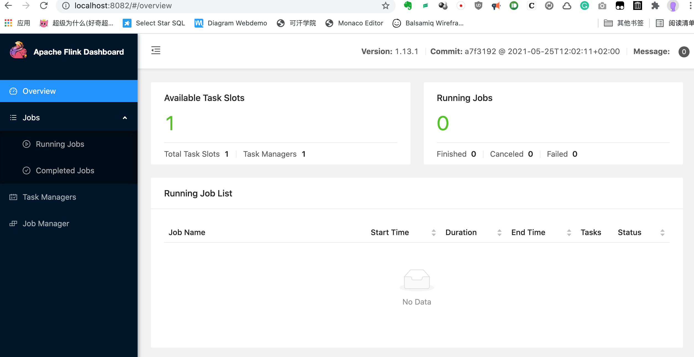
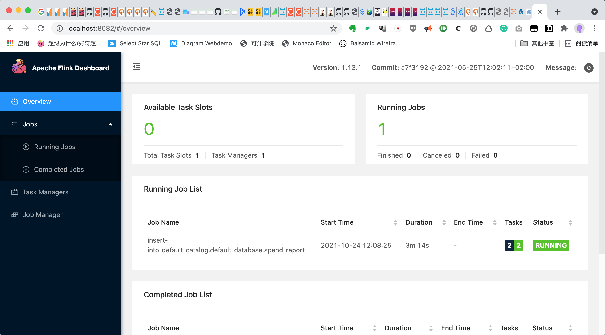
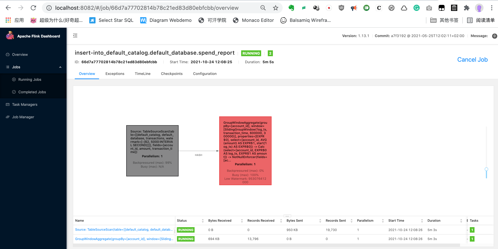
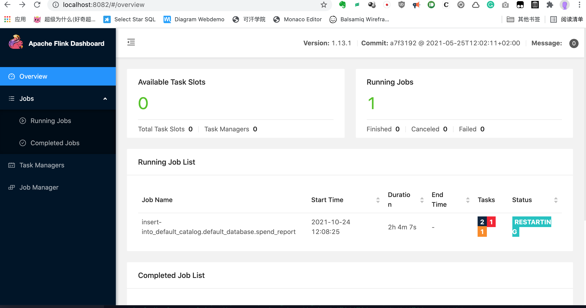
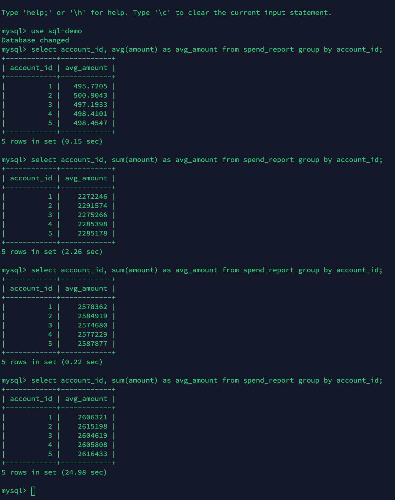
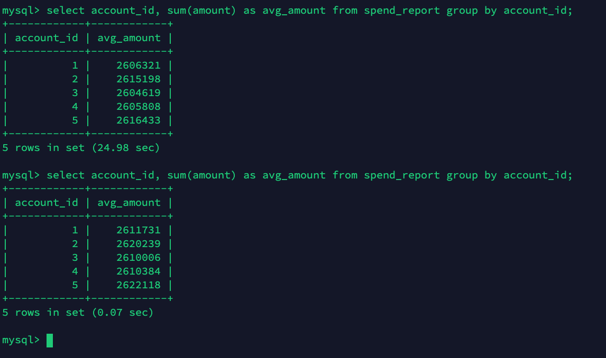
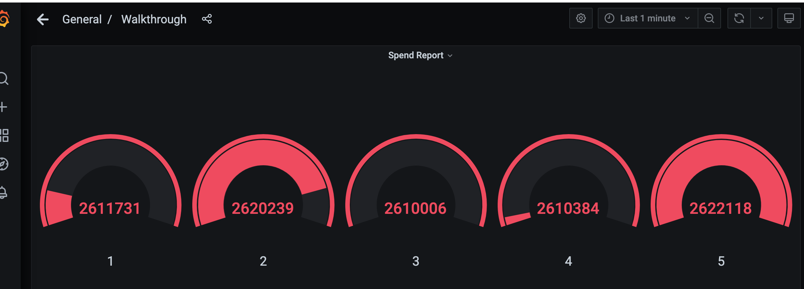

## Flink 作业 - 实现方法public static Table report(Table transactions)

### 题目

report(transactions).executeInsert("spend_report");
将transactions表经过report函数处理后写入到spend_report表。

每分钟（小时）计算在五分钟（小时）内每个账号的平均交易金额（滑动窗口）？

注：使用分钟还是小时作为单位均可

#### 相关代码

修改table-walkthrough/src/main/java/org/apache/flink/playgrounds/spendreport代码达到使用滑动窗口，每小时统计在5小时内每个账号的平均交易额。

- [修改后spendreport代码](src/SpendReport.java)

#### 执行结果和监控Dashboard

**Flink Dashboard**

Job还未开始运行时的主页面

Job运行时的主页面

Job页面

Docker修改后重新build时的主页面

**MySQL执行结果如下**：

mysql结果1:

mysql结果2:

**Grafana查看结果如下**：

