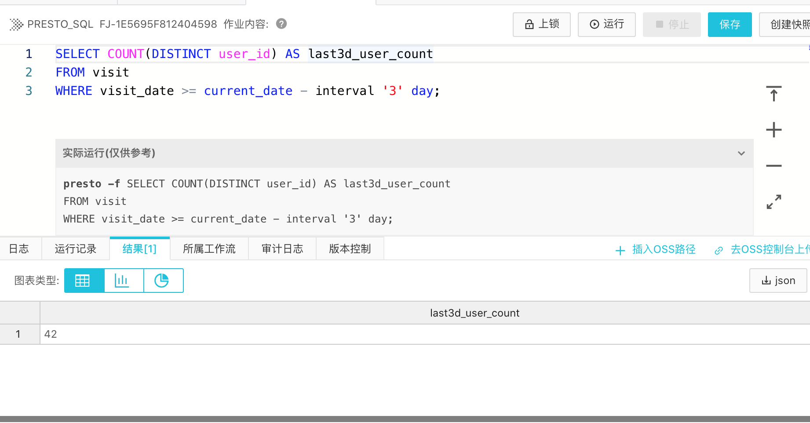

## Presto 作业 - 近似计算(HyperLogLog算法)在Presto的应用

### 问题1: HyperLogLog的用途或大数据场景下的实际案例

#### 常见使用场景

HyperLogLog适合统计各种基数(cardinality)数量庞大，对精确统计要求不高，对时效性要求较高的场景。如

- 统计截止到特定时间为止或特定时间段完成特定行为的 IP 数量；
- 统计当前访问网站或特定网页的实时客户(Unique Visitor)数量；
- 统计特定时间段内的页面浏览量(Page Views)；
- 统计用户特定时间段内搜索的不一样的关键词或词组的数量；
- 统计特定数据中心，集群或服务器上正在运行的作业(job)数量。

#### 应用举例

- [Approximate Algorithms in Apache Spark: HyperLogLog and Quantiles](https://databricks.com/blog/2016/05/19/approximate-algorithms-in-apache-spark-hyperloglog-and-quantiles.html)
- [Presto HyperLogLog Functions](https://prestodb.io/docs/current/functions/hyperloglog.html)
- [Redis HyperLogLog](https://news.ycombinator.com/item?id=7506774)
- [Druid Cardinality Estimation with Scaled HyperLogLog](https://druid.apache.org/blog/2014/02/18/hyperloglog-optimizations-for-real-world-systems.html)
- [DorisDB用HLL实现近似去重](http://doc.dorisdb.com/2146010)
- [Reddit上帖子的View Counting](https://www.redditinc.com/blog/view-counting-at-reddit/)
- [Amazon Redshift](https://aws.amazon.com/blogs/big-data/use-hyperloglog-for-trend-analysis-with-amazon-redshift/)
- [Google BigQuery](https://cloud.google.com/blog/products/gcp/counting-uniques-faster-in-bigquery-with-hyperloglog)
- [Efficient Cardinality Estimation using HLL with Spark and Postgres and Other References](https://towardsdatascience.com/efficient-cardinality-estimation-using-hll-with-spark-and-postgres-dcf1cd66ede9)
- [Counting Crowds: HyperLogLog in Simple Terms and Other References](https://medium.com/@winwardo/counting-crowds-hyperloglog-in-simple-terms-1d345637db5)
- [HyperLogLog Usage in Oracle](https://docs.oracle.com/en/database/oracle/oracle-database/21/tgsql/gathering-optimizer-statistics.html#GUID-EA02EA33-9E0E-4E32-8C74-5943908D0537)

---

### 问题2: 在本地docker环境或阿里云e-mapreduce环境进行SQL查询，要求在Presto中使用HyperLogLog计算近似基数。

**建立相应表的DDL语句**：

```SQL
CREATE TABLE visit (
user_id int,
visit_date date,
media varchar
);

CREATE TABLE wp_customer_sk_approx (
hll varbinary
);
```

**生成查询数据的DML语句**：

```SQL
INSERT INTO visit VALUES 
(101, DATE('2021-09-27'), 'organic search'), 
(101, DATE('2021-09-27'), 'paid search'),
(102, DATE('2021-09-27'), 'organic search'),
(103, DATE('2021-09-28'), 'organic search'),
(103, DATE('2021-09-29'), 'organic search'),
(104, DATE('2021-09-29'), 'paid search'),
(105, DATE('2021-09-29'), 'referral'),
(106, DATE('2021-09-30'), 'organic search'),
(107, DATE('2021-09-30'), 'referral'),
(101, DATE('2021-10-01'), 'organic search'), 
(102, DATE('2021-10-01'), 'organic search'),
(102, DATE('2021-10-01'), 'paid search'),
(103, DATE('2021-10-01'), 'organic search'),
(103, DATE('2021-10-01'), 'referral'),
(104, DATE('2021-10-01'), 'organic search'),
(105, DATE('2021-10-01'), 'organic search'),
(106, DATE('2021-10-01'), 'organic search'),
(107, DATE('2021-10-01'), 'organic search'),
(111, DATE('2021-10-02'), 'organic search'), 
(112, DATE('2021-10-02'), 'organic search'),
(112, DATE('2021-10-02'), 'paid search'),
(113, DATE('2021-10-02'), 'organic search'),
(113, DATE('2021-10-02'), 'organic search'),
(114, DATE('2021-10-02'), 'organic search'),
(115, DATE('2021-10-02'), 'organic search'),
(116, DATE('2021-10-02'), 'organic search'),
(117, DATE('2021-10-02'), 'organic search'),
(121, DATE('2021-10-02'), 'organic search'), 
(122, DATE('2021-10-02'), 'organic search'),
(122, DATE('2021-10-02'), 'organic search'),
(123, DATE('2021-10-02'), 'organic search'),
(123, DATE('2021-10-03'), 'organic search'),
(124, DATE('2021-10-03'), 'organic search'),
(125, DATE('2021-10-03'), 'organic search'),
(126, DATE('2021-10-03'), 'organic search'),
(127, DATE('2021-10-03'), 'organic search'),
(211, DATE('2021-10-03'), 'organic search'), 
(212, DATE('2021-10-03'), 'organic search'),
(212, DATE('2021-10-03'), 'paid search'),
(213, DATE('2021-10-03'), 'organic search'),
(213, DATE('2021-10-04'), 'organic search'),
(214, DATE('2021-10-04'), 'organic search'),
(215, DATE('2021-10-04'), 'organic search'),
(216, DATE('2021-10-04'), 'organic search'),
(217, DATE('2021-10-04'), 'organic search'),
(221, DATE('2021-10-04'), 'organic search'), 
(222, DATE('2021-10-04'), 'referral'),
(222, DATE('2021-10-04'), 'organic search'),
(223, DATE('2021-10-04'), 'organic search'),
(223, DATE('2021-10-04'), 'organic search'),
(224, DATE('2021-10-04'), 'organic search'),
(225, DATE('2021-10-04'), 'organic search'),
(226, DATE('2021-10-04'), 'organic search'),
(227, DATE('2021-10-04'), 'organic search'),
(311, DATE('2021-10-04'), 'organic search'), 
(312, DATE('2021-10-05'), 'organic search'),
(312, DATE('2021-10-05'), 'organic search'),
(313, DATE('2021-10-05'), 'organic search'),
(313, DATE('2021-10-05'), 'organic search'),
(314, DATE('2021-10-05'), 'organic search'),
(315, DATE('2021-10-05'), 'organic search'),
(316, DATE('2021-10-05'), 'organic search'),
(317, DATE('2021-10-05'), 'organic search'),
(321, DATE('2021-10-05'), 'organic search'), 
(322, DATE('2021-10-05'), 'organic search'),
(322, DATE('2021-10-05'), 'organic search'),
(323, DATE('2021-10-05'), 'organic search'),
(323, DATE('2021-10-05'), 'organic search'),
(324, DATE('2021-10-05'), 'organic search'),
(325, DATE('2021-10-05'), 'organic search'),
(326, DATE('2021-10-05'), 'organic search'),
(327, DATE('2021-10-05'), 'organic search')
;

INSERT INTO wp_customer_sk_approx
SELECT cast(approx_set(wp_customer_sk) AS varbinary)
FROM web_page;
```

**获得和验证结果的DML语句**：

```SQL
SELECT cardinality(merge(cast(hll AS HyperLogLog))) AS last3d_user_count
FROM visit_approx
WHERE visit_date >= current_date - interval '3' day;

SELECT COUNT(DISTINCT user_id) AS last3d_user_count
FROM visit
WHERE visit_date >= current_date - interval '3' day;
```

> **备注**：我们的EMR集群使用的是Presto 338。按照对应的[trino官方文档](https://trino.io/docs/338/functions/hyperloglog.html)`approx_set`函数只有1个入参，不支持表示maximum standard error的入参e。

**执行结果如下**：

EMR上HyperLogLog的查询结果为49。


EMR上精确的Distinct Count查询结果也为49，两者一致。



本地Docker模拟已有数据的Catalog和schema内执行INSERT语句出错，用APPROX_DISTINCT进行计算。


### 问题3: 学习使用Presto-Jdbc库连接docker或e-mapreduce环境，重复问题2的查询。（选做）

现在判断解决方法是把HyperLogLog的生成和查询语句写在代码内，调用Java代码实现。如果题意理解有偏差，可以反馈。谢谢。

本地环境的搭建需要查询其实现方式，从零配置，对我来说比较费时间。

EMR还不确定如何用SSH或其他方式可以调用本地编写好的JAR包。如果有参考可以之后试一试。

